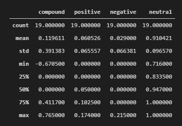
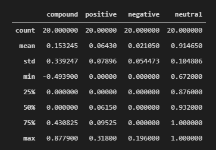

# crypto_sentiment_nlp

____

## **Crypto Sentiment Analysis (Natural Language Processing):**

This repository is dedicaded to analyze people sentiments onto 2 of the most common cryptocurrencies (Bitcoin and Ethereum).

The analysis is solely based on news extracted from [newsapi](https://newsapi.org/) and utilizing Natural Language coding to identify the 10 most common words used in reference to these cryptos as well as the sentiment score (positive, negative or neutral) that encompass those cryptocurrencies.

The attched jupiterlab notebook has three segments:

&ensp; **Sentiment Analysis**, performed with [Vader Sentiment Analysis](http://www.nltk.org/howto/sentiment.html) to determine the sentiment (positive, negative or neutral) towards Bitcoin and Ethereum.

&ensp; **Natural Language Processing**, which consists of tokenizing, gathering the 10 most popular bigrams combinations as well as a Word Cloud chart showcasing the word frecuency on both cryptos.

&ensp; **Name Entity Recognition**, in which the two main entities were segregated ("ORG" and "GPE") from all the extracted news texts.

## Results:

&ensp; **Sentiment Analysis**: based on the mean value for the compound score, Ethereum sentiment is more positive than the one for Bitcoin. Additionally, Ethereum positive sentiment scored higher than Bitcoin, while the negative score was higher for Bitcoin than Ethereum.

Due to the above, the sentiment outlook is more favorable toward Ethereum than Bitcoin.

<table>
  <tr>
    <td>Bitcoin Sentiment</td>
     <td>Ethereum Sentiment</td>
  </tr>
  <tr>
    <td></td>
    <td></td>
  </tr>
</table>

 

____
### Sources:

Cryptocrurrencies "gif" was prepared with pictures provided license-free from these photographers (available on Unsplash.com):

[1] (https://unsplash.com/photos/bj8U389A9N8?utm_source=unsplash&utm_medium=referral&utm_content=creditShareLink)

[2] (https://unsplash.com/photos/hiFghSs4keM?utm_source=unsplash&utm_medium=referral&utm_content=creditShareLink)

[3] (https://unsplash.com/photos/0bO235Rhqec?utm_source=unsplash&utm_medium=referral&utm_content=creditShareLink)

[4] (https://unsplash.com/photos/JrjhtBJ-pGU?utm_source=unsplash&utm_medium=referral&utm_content=creditShareLink)

[5] (https://unsplash.com/photos/uw3VwkDHiMI?utm_source=unsplash&utm_medium=referral&utm_content=creditShareLink)